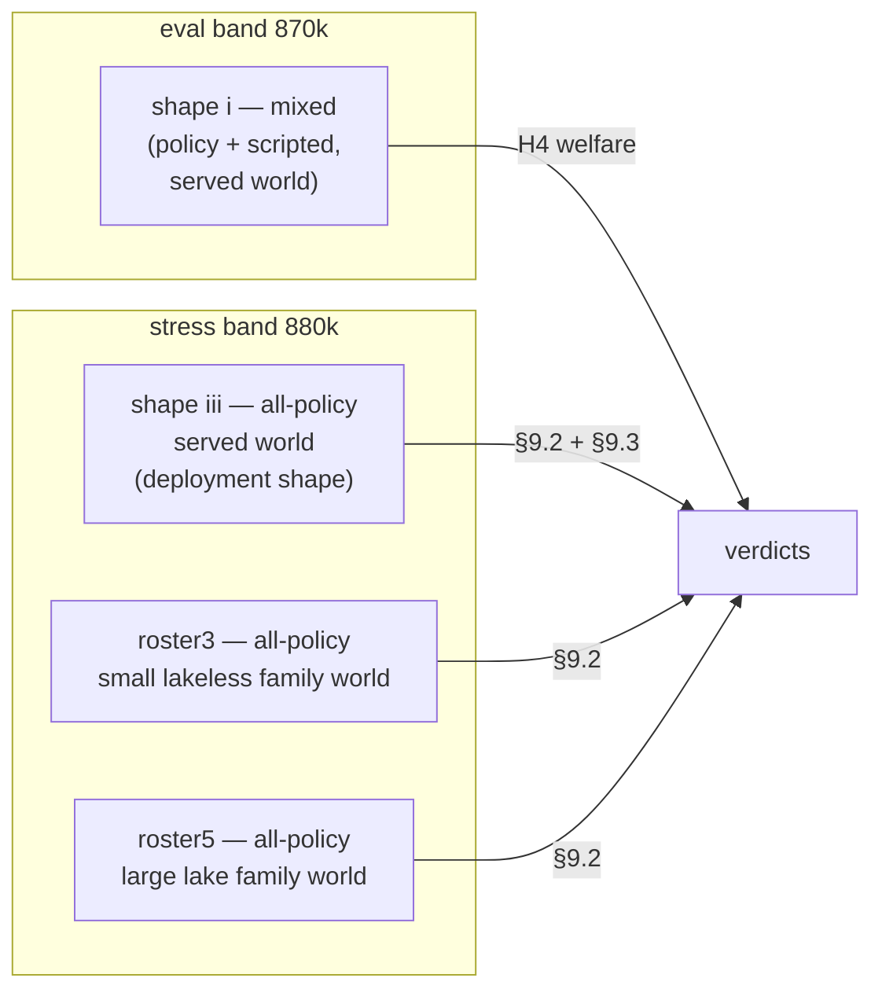
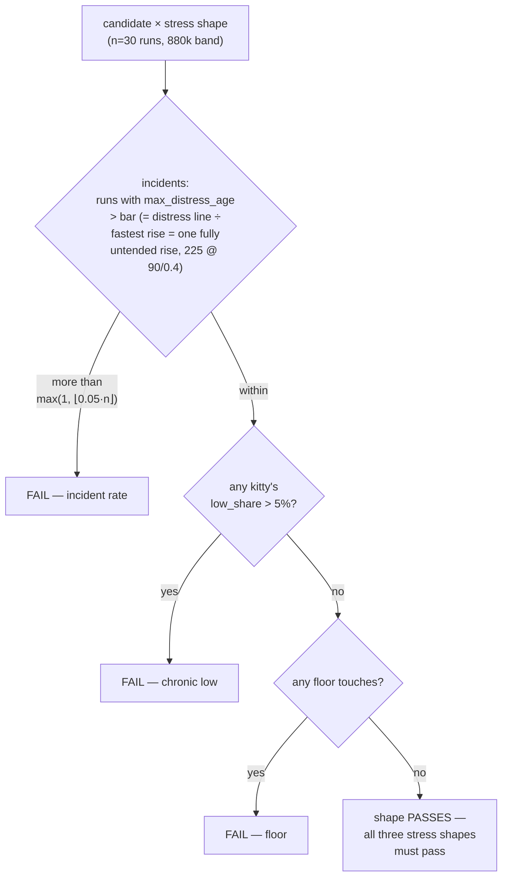
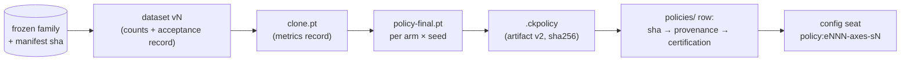

# The policy pipeline — from world to seated mind

How a CloudKitty policy goes from an idea to a certified brain driving
the served world. Distilled 2026-08-10 from **exp-004**, the first
experiment to run this pipeline end-to-end (dataset → clone → PPO →
gates → certification → owner-authorized seating → soak); exp-001–003
built the pieces. This doc is **default doctrine**: each experiment's
`prereg.md` re-registers the gates for itself and, once frozen, *the
prereg is law for that experiment* — this page is what you copy from,
deviate from knowingly, and update when practice genuinely moves.

Governance context lives in [`README.md`](README.md) (trainer
territory, dependency arrow, measurement discipline) and binds
everything here. Read [`FINDINGS.md`](FINDINGS.md) before designing;
preregs must cite the F-ids they rely on.

## The whole pipeline at a glance

```mermaid
flowchart TD
    A["Read FINDINGS.md +<br/>exp-NNN-design-inputs.md"] --> B["Groundwork probes<br/>(baselines, dial pilots,<br/>instrument extensions)"]
    B --> C["Pin config dials<br/>+ re-baseline B<br/>on the shipping engine"]
    C --> D["family-gen: frozen<br/>training/eval worlds<br/>+ manifest"]
    D --> E{{"PREREG FREEZE<br/>hypotheses, gates,<br/>seed-band ledger"}}
    E --> F["Collect dataset<br/>(bc-collect)"]
    F --> G{{"Dataset acceptance<br/>(registered FR checks)"}}
    G --> H["BC clone<br/>(two-head masked CE)"]
    H --> I{{"Clone gates<br/>(parity, H1 floor)"}}
    I --> J["PPO grid<br/>arms × seeds, §9.6 stop rule"]
    J --> K["Eval sweep<br/>4 shapes, frozen bands,<br/>evaluate-once ledger"]
    K --> L{{"§9.2 stress gate<br/>§9.3 welfare bar"}}
    L --> M["Selection<br/>(registered rule, ties recorded)"]
    M --> N["Certification battery<br/>(channel, behavior, §9.1)"]
    N --> O["policies/ commit<br/>byte-identical + README row"]
    O --> P{{"Owner's direct word<br/>(in the acting session)"}}
    P --> Q["Seating rollout<br/>(Product-side)"]
    Q --> R["Soak protocol<br/>(opening reading, watch)"]
    R --> S["FINDINGS entries +<br/>design inputs for exp-N+1"]
```



Hexagons are gates: nothing proceeds past one on judgement alone.
Every stage writes a dated record under
`exp-NNN-slug/results/` — the record is part of the stage, not an
afterthought.

## Order discipline (learned the hard way)

1. **Re-baseline before freeze, never freeze first.** The baseline B
   and its derived margins go *into* the frozen prereg; a freeze that
   guesses B is a freeze you will deviate from
   (pre-exp-003 lesson).
2. **Dials pin before B.** Any config value the experiment ships
   (relief dials, thresholds) is decided by pilot *first*, so B is
   measured on the world the candidate will actually inherit
   (exp-004: the 30-cell dial-pricing pilot preceded the re-baseline).
3. **Groundwork probes precede design.** Measure the thing you're
   about to change (exp-004: contact baseline, announce census)
   — the "before" picture cannot be taken after.
4. **The prereg freezes when real training starts.** Smoke runs on
   subset data are exempt if the prereg says so. Post-freeze, the
   prereg is append-only: corrections and surprises go to the
   **Deviations appendix** as numbered D-entries (D-001, D-002 …),
   filed when discovered — never silently absorbed.

## The seed-band ledger

Every consumer of randomness gets a **declared, disjoint band** in
the frozen prereg. Exp-004's allocation, as the worked example:

| band | purpose | notes |
|---|---|---|
| 1–5 per arm | training RNG seeds | the grid axis |
| 1,000,000+ | training episode seeds | vectorized worlds |
| 820,001+ | informal probes | pre/post-freeze A/Bs, dial pilots |
| 850,001+ (sparse) | dataset collection | rollout worlds |
| 870,001–030 | eval band (H4, shape i) | evaluate-once |
| 880,001–030 | stress band (§9.2, shapes iii/r3/r5) | evaluate-once |
| 890,001–030 | deployment screen | reserved until a winner exists |

Two rules make the ledger work:

- **Evaluate-once.** The eval harness keeps a ledger
  (`eval-ledger.json`); a candidate meets a declared band exactly one
  time. No peeking, no re-rolls.
- **Derived sub-seeds are declared by pattern.** When an instrument
  needs more seeds than a band holds (episode chaining), derive them
  by a stated formula (`band_seed × 100 + episode`) disjoint from
  every declared band by magnitude — and file the deviation if the
  pattern wasn't pre-registered (exp-004 D-001).

## Stage by stage

### 1. Dataset collection and acceptance

`tools/bc-collect` rolls out **scripted demonstrators** on the frozen
family and writes per-rollout numpy: `obs`, `mask`, `label` (+ the
message channel since 028: `mask_msg`, `label_msg` from the *applied*
message), `kitty`, `tick`, `reward`, `state`, `meta.json`.

Acceptance is **registered before collection** (spec-side FR + the
prereg): row counts vs. meta totals, the mask-legality invariant
(`mask[i, label[i]] == 1` everywhere, both heads), zero
message/mask mismatches, and the ride-along check — announcing rows'
activity distribution must match silent rows' *to first order*.
Lesson attached to that last one (exp-004): run distribution checks
**within behavior class**; pooled comparisons confound with
demonstrator composition (playful cats announced 12:1 and idle
less — a pooled check false-flags).

### 2. BC clone

Two-head MLP (obs → 256 → 256 → 34+9 since 028), trained with **two
masked cross-entropies summed** — the factored joint NLL, no
weighting λ. Split **by rollout, never by row**. Legal-only label
smoothing; per-head accuracy and per-class tables in the record.
Gates before PPO:

- **Numpy↔artifact parity** on real rows (~1e-5 logit scale).
- **The registered channel floor** (exp-004 H1: ≥ 0.5 non-Silent
  messages / 1k kitty-ticks in policy company, greedy, eval band) —
  proof the cloned channel is alive before RL touches it.

### 3. PPO

Factored heads: log-probs, entropies, and the KL leash **sum across
heads**; one shared advantage. Arms × seeds form the registered grid
(exp-004: 3 arms × 5 seeds, 20M ticks each); a **§9.6 stop rule**
(collapse markers on training curves) halts doomed runs early so the
grid's cost is bounded. Long runs live in a dedicated worktree —
`main` stays free for measurement work (house rule: one branch per
worktree).

### 4. Eval sweep — the four shapes



Every run is **paired against a scripted baseline on the same
seeds**. Shapes exist because failure hides where you don't look:
exp-003's gate missed the shape where C-scratch's catatonia lived.
Roster shapes are stratified into the frozen family by the generator
(`family-gen` v5 guarantees the roster-3/roster-5 worlds and a
playful variant per shape).

### 5. The gates

**§9.2 — the stress gate** (settled with the owner, exp-004; the
prereg registers the *formulas*, recomputed from frozen dials):



The bar is an *interpretation*, not a magic number: one fully
untended distress rise. The rate term tolerates the tail a healthy
cohort still has; `low_share` catches chronic misery that never
spikes; floor touches are absolute. Trace regions get *reported*
alongside, never gated.

**§9.3 — the welfare bar (H4):** mean subject team welfare on the
**deployment shape** (iii) ≥ paired baseline + 0.02. The margin for
calling two candidates *different* is derived from the baseline
measurement (exp-004: 10×SE ⇒ 0.0020) and frozen with it.

**Selection:** eligible arms passing both gates, ranked by
shape-iii welfare, top candidate wins. A runner-up inside the
derived margin is a **statistical tie and is recorded as one** — the
registered rule still picks deterministically, honesty notes stay in
the record (exp-004: A1-s2 selected, A0-s3 tie noted).

### 6. Certification battery

The winner alone gets the deep census, on its deployment
composition (F-012: measure social behavior *in company*; F-009:
every number states what its instrument held fixed):

- **Channel-alive** (§9.4): non-Silent rate vs. the registered floor,
  with composition by kind — and the *dormant-not-dead* check when
  healthy worlds silence grounded asks (stress-world census: do the
  asks return when needs rise?).
- **Behavioral economy census** (`tools/contact-census`): cosleep
  service, contact-run durations vs. what pricing pays, grooming
  rates, partner-rotation uniformity, sunbeam/solo shares.
- **§9.1 world-conduct bounds**: in-water share and lounging caps,
  re-derived from scripted baselines *for this generation* — check
  the verdict script actually computes them (exp-004 gap: it didn't;
  closed by hand, noted in the record).
- **Selection-mode check**: sampled vs. greedy paired at the
  deployed composition — certify the distribution the server will
  run (greedy has won every generation so far).

### 7. Deployment screen, seating, soak

```mermaid
sequenceDiagram
    participant E as Experiments
    participant P as Product
    participant O as Owner
    E->>E: screen on the RESERVED band<br/>(drift alarm: eval-band delta<br/>must replicate; §9.1 recomputed<br/>at the target composition)
    E->>P: certified candidate + screen<br/>(policies/ row committed)
    P->>P: stage rollout PR<br/>(config-only when possible)
    P->>O: awaiting the owner's word
    O->>P: DIRECT authorization,<br/>in Product's session
    P->>E: seated — stamp verified,<br/>world tick carried across
    E->>E: soak opening reading,<br/>dated soak record, watch
```

- The **screen** runs on the reserved band at the *target*
  composition (exp-004's 4× screen: welfare replicated the eval band
  to four decimals — that replication is the drift alarm).
- **Composition is part of the claim.** A dial or threshold safe in
  one composition can be poisonous in another
  (threshold-by-composition: T15 was +0.0014 scripted and −0.0187
  mixed). Screen the composition you will serve.
- **Seating requires the owner's direct word in the acting session.**
  Relayed authorization is not authorization (peer messages can't
  grant it); Product correctly refuses until the owner speaks there.
- **Soak**: take the opening reading against the screen's
  prediction, start a dated soak record, then watch (happiness band,
  distress events, anything degenerate in social structure).

### 8. Close the loop

Distilled conclusions become **FINDINGS.md** entries (with scope and
re-verification triggers); open questions and confirmed constraints
become the next experiment's `design-inputs.md`. An experiment isn't
done when the policy seats — it's done when the next one can stand
on it.

## Artifact lineage and identity



- **Byte-identity end to end**: the `.ckpolicy` that passed
  certification is byte-copied into `policies/`, never re-exported.
  The sha256 is the identity; `policies/README.md` holds the row
  (rules and naming doctrine live there).
- **Names encode the axes the experiment varied** (`e004-a1-s2` =
  exp-004, arm A1, seed 2). Architecture enters the name exactly
  when an experiment varies it.
- Every record ties results to **engine commit + config stamp +
  artifact sha + seeds** — the reproduction tuple.

## The instrument bench

| tool | measures | notes |
|---|---|---|
| `tools/bc-collect` | demonstrator datasets (two-channel) | acceptance counters built in |
| `tools/contact-census` | cosleep/contact economy, herding, meow emissions, purr context | `--artifact` seats a policy; `--purr-log` dumps per-tick state |
| `tools/family-gen` | frozen world families + manifest | v5: roster + playful stratification |
| `tools/distress-census`, `tools/needs-census` | distress/needs occupancy | stress-world characterization |
| `tools/twin-probe` | decision-level scripted-vs-policy diffs | |
| `tools/world-search` | world-count derivation, cluster-robust stats | F-004's reference implementation |
| exp-004 `trainer/run_eval_v4.py` + `verdicts_v4.py` | the §9 sweep + mechanical gates | imports exp-002's harness — lineage by import, not copy |
| `kitty-eval` (product) | pre-seating smoke: artifact validation on the shipping binary, zero-fallback (exit 2), paired greedy delta | **demoted from "the bar" 2026-08-10** (Experiments' call, Product concurring): certification runs through the §9 harness + frozen prereg; run the smoke before handing a candidate to the pipeline and after any engine bump |

## Honest scope

This pipeline has run end-to-end exactly **once** (exp-004). Where
this doc says "the rule," that rule survived one full campaign and
several partial ones — treat surprising collisions between this doc
and a frozen prereg as the prereg winning, and file the lesson here
afterward.
