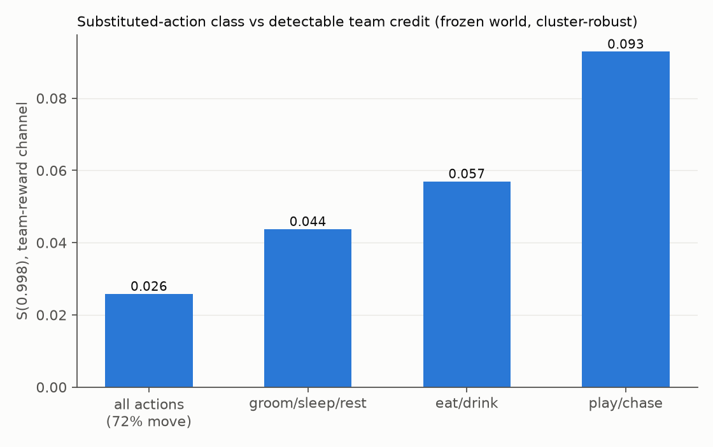
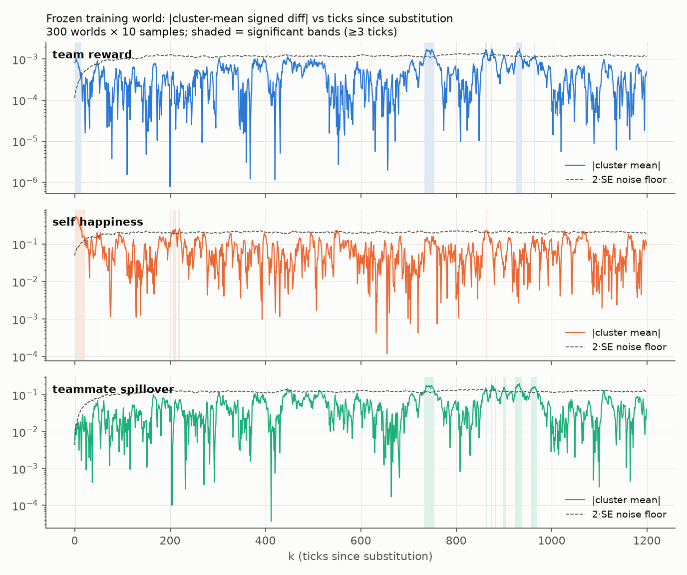
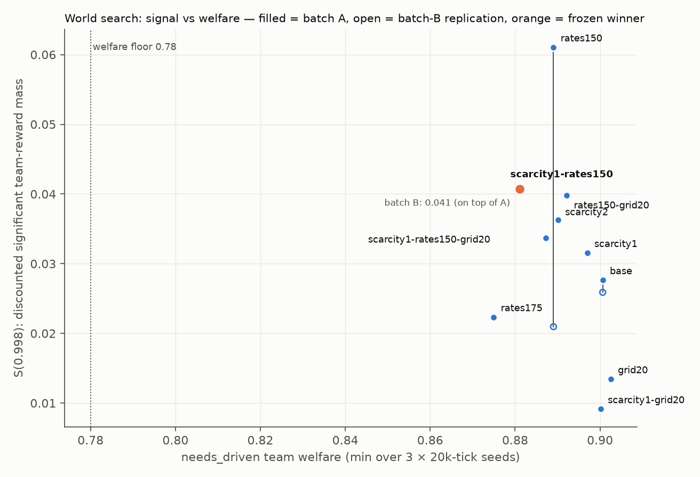

# Frozen-world addendum: class-conditioned credit, the F-002 census, de-riskers, figures

**Date**: 2026-07-27 · **World**: frozen `training.toml` (scarcity1-rates150)
· **Statistics**: cluster-robust per F-004 throughout

## 1. Class-conditioned credit (probe `--only-action`)

1,000 samples per class, 150 worlds (seeds 3001–3150), 1,200-tick traces:

| Substituted class | dr significant ticks | S(.998) | vs all-action mix |
|---|---|---|---|
| all actions (72% move) | 68 | 0.026 | 1× |
| groom/sleep/rest | 67 | 0.044 | 1.7× |
| eat/drink | 63 | 0.057 | 2.2× |
| play/chase | 148 | 0.093 | **3.6×** |

Two conclusions. First, **the unconditioned probe numbers (F-003/F-005)
are heavily diluted by move substitutions** — most single moves are
inconsequential, and they are 72% of the mix. Conditioned on decision
classes that commit resources, the detectable team signal is 2–4× larger.
Second, **play/chase is the strongest cooperative lever** in the frozen
world (binding partners, chasing shared critters), with eat/drink
contention second — a concrete prior for where a trained policy's gains
should first appear (§10.1's journey-length and per-kitty-spread
diagnostics should be read with this in mind).

Class-filter mechanics note: filtered classes show high degenerate rates
(social classes ~70%), because substituting idle into a mid-scene
sleep/rest is rewritten back by duration enforcement — surviving samples
are true scene-*start* decisions, which is the selection we want.

## 2. The F-002 census (cuddle-route recount) — headroom hypothesis refuted

Instrumented `needs_driven` rollouts using the engine's own predicates
(`is_available_friend` / `is_conscriptable_friend`), 5 seeds × 20k ticks
per config (`experiments/tools/twin-probe/src/bin/cuddle-census.rs`):

- **The mechanical under-use is real**: at cuddle ≥ 40 with only busy
  friends adjacent, `needs_driven` takes a non-binding route
  (`Sleep{with}`/`Groom{target}`) in **2 of 294** opportunities (0.7%);
  with a free friend adjacent it *never* does (0/831 — it prefers the
  binding rest duet, 349 times). The routes are effectively unused by
  the scripted cat.
- **But the welfare stakes evaporated post-retune**: high-need
  opportunities beside friends are nearly extinct — cuddle ≥ 80 beside
  busy-only friends occurred **2 times in 100k ticks** on the frozen
  world and **once in 100k** on the default world (cuddle ≥ 95: zero).
  The retune's heavier cuddle weight makes `needs_driven` service the
  need long before it gets high.
- Boundary note: a few "binding rest" events appear in busy-only ticks —
  classification jitter where a friend's activity clock expires within
  the tick. Counted separately; does not affect the conclusion.

The 38 pre-retune events cited when F-002 was reserved described a world
that no longer exists. Register verdict: **F-002 refuted as material
headroom** (recorded in FINDINGS.md); what survives is the interpretation
rule already in the prereg — the non-binding routes are in the menu and
mask, so a trained policy *can* use them, and Cuddle pinned streaks
beside busy friends remain a real (if now rare) skill gap, not an eval
bug.

## 3. De-riskers — both pass

- **Artifact round-trip** (§4/§11 checklist item): a 182→256→256→40
  artifact written via `write_artifact`, loaded against
  `PolicyBehavior::expectations(RlConfig)` from the frozen
  `training.toml` (obs 182 / menu 40 confirmed), forward pass returns 40
  finite logits, bit-identical across calls. Harness in session
  scratchpad; the crate's own APIs did all the work.
- **Python surface + throughput** (SC-003): `ParallelEnv("training.toml")`
  — 5 agents, obs 182, mask 40, `reset(seed)` bit-reproducible,
  terminations always false, truncation enforced at horizon 2,000
  (step-after-truncation correctly raises). **36,200 env-steps/sec**
  single env (SC bar: 5,000) including Python-side action sampling;
  `VectorEnv(8)` batched dict API: **56,500 world-steps/sec ≈ 283k
  kitty-decisions/sec**. At these rates a 50M-step training budget is
  ~15 minutes of env time — the learner, not the engine, will be the
  bottleneck.

## 4. Figures

The per-channel traces make F-005's "detection floor" concrete: the
cluster-mean sits under the 2·SE floor almost everywhere, with the
replicated late bands (k ≈ 733–754, 860–937) the visible exceptions in
both the team-reward and spillover panels.

The search's signal-vs-welfare landscape: batch-A points with batch-B
replication marks; `rates150`'s collapse is the vertical drop, the
winner's batch-B value lands on top of its batch-A point.

## Reproduce

Class probes: `twin-probe --config training.toml --samples 1000
--trace-len 1200 --seeds 3001..3150 --probe-seed 42 --quiet
--only-action <classes>`. Census: `cuddle-census <config> 20000
1,2,3,4,5 <threshold>`. Figures: deterministic from the committed raw
regeneration commands + the plotting code in this doc's git history.
